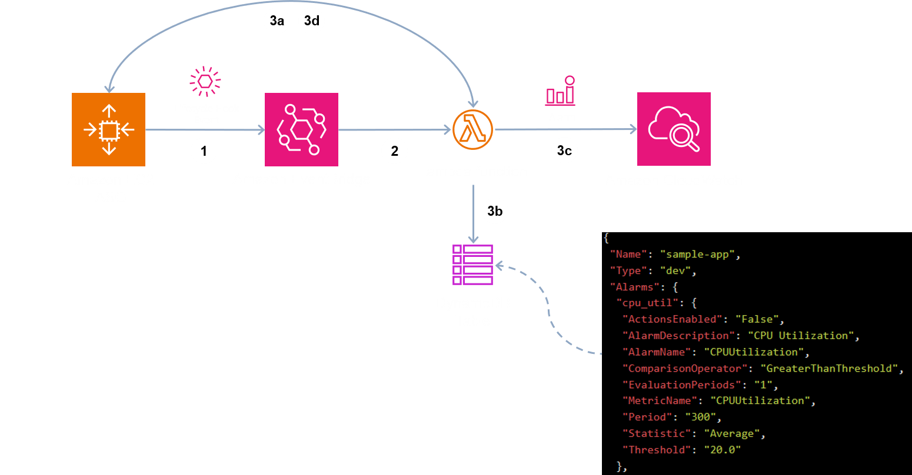

# Managing CloudWatch Alarm for EC2 Auto Scaling Groups

This solution enables you to automatically create and delete CloudWatch Alarms for EC2 instances that are part of an Auto Scaling Group (ASG).

CloudWatch Alarms can be automated using Infrastructure As Code (IaC) services like AWS CloudFormation, however it is not straightforward to maintain and call these IaC stacks for each EC2 instance that gets launched or terminated in an ASG.
This solution helps you overcome this challenge by defining the Alarms as configuration items in a DynamoDB (DDB) table. The defined Alarms that will be automatically created when a new instance is launched and then cleaned up when the instance gets terminated. This enables you to easily add, update or delete these alarm configurations as needed, without having to manually configure them each time.

## Architecture



1. The EC2 ASG will use a [lifecycle hook](https://docs.aws.amazon.com/autoscaling/ec2/userguide/lifecycle-hooks.html) to send the Launch/Terminate events to EventBridge
2. An EventBridge rule will match the event sent from the ASG lifecycle hook and invoke a Lambda function
3. The Lambda function will:
   - read the EC2 tags (to know the profile of that instance)
   - get the CloudWatch Alarms definition from DDB that correspond to this profile
   - create the Alarms in CloudWatch
   - [complete the lifecycle action](https://docs.aws.amazon.com/autoscaling/ec2/APIReference/API_CompleteLifecycleAction.html)


During the initial deployment, the solution will use a Custom Resource lambda function to populate the DDB Table with a default set of Alarms.

[DDB Streams](https://docs.aws.amazon.com/amazondynamodb/latest/developerguide/Streams.html) is used to capture update/add/delete changes done on the Alarm definition and invoke the Lambda function to reflect them in CloudWatch.

## Pre-requisites
For this solution, you will need:

1. AWS account & IAM User or Role 
2. AWS CDK v2: [Getting started with AWS CDK](https://docs.aws.amazon.com/cdk/v2/guide/getting_started.html)
3. EC2 Auto Scaling Group (ASG) with lifecycle hook configure for instance launch & terminate:  [Add lifecycle hooks](https://docs.aws.amazon.com/autoscaling/ec2/userguide/adding-lifecycle-hooks.html#adding-lifecycle-hooks-console)
4. The ASG needs to have the following three Tags: 
   - `create-cloudwatch-alarm`: The lambda function will check for this tag key. If it found, then it will create the CloudWatch Alarms.
   - `application-name-tag`: This is passed in the deploy command to create the `Name` record value in the DDB Table. e.g. `app`
   - `application-type-tag`: This is passed in the deploy command to create the `Type` record value in the DDB Table. e.g. `dev`

5. SNS Topic that will be used for the Alarms notification. You can use an existing topic or create a new one: [Creating an Amazon SNS topic](https://docs.aws.amazon.com/sns/latest/dg/sns-create-topic.html)


## Setup

Clone this repo:
 ```bash
 git clone https://github.com/aws-samples/cloudwatch-alarm-management-for-asg.git
 ```

Change directory:
 ```bash
 cd cloudwatch-alarm-management-for-asg
 ```

Run the following commands to install dependencies and build the cdk files:
 ```bash
 npm ci
 ```


## Deployment

Configure your [AWS credential keys](https://docs.aws.amazon.com/cli/latest/userguide/cli-configure-quickstart.html) to authenticate and authorize the AWS CLI CDK commands on your account.

Bootstrap your CDK [environment](https://docs.aws.amazon.com/cdk/v2/guide/environments.html):

```bash
cdk bootstrap aws://{ACCOUNT-ID}/{AWS-REGION}
```


At this point you can now synthesize the CloudFormation template for this code:
```bash
cdk synth
```

And proceed to deployment of the stack:
```bash
cdk deploy --context snsTopicArn={SNS-TOPIC-ARN} --context appTagName={APP-TAG-NAME} --context appTagType={APP-TAG-TYPE}
```


After running this command, you should see a new stack created in CloudFormation that will deploy the resources mentioned in the [Architecture](#architecture) section
    


## Usage
After the deployment, you should be able to test out the solution by simply adjusting your ASG desired capacity:
- When you add instances, you should see a new set of Alarms in CloudWatch for that instance.
For example, let's say your instance has the id  `i-0bc123231asc22123`, an `application-name-tag` value `app` and a `application-type-tag`  value `dev`. Assuming in DDB you defined two alarms for the `CPUUtil%` and `MemAvailableGB` metrics - you should see the following alarms in CloudWatch:

        app-dev-i-0bc123231asc22123-CPUUtil%
        app-dev-i-0bc123231asc22123-MemAvailableGB


- When you terminate the instance, the alarms will get deleted automatically. 

- When you update/delete/add any existing Alarms in the DDB Table, the changes will automatically re-invoke the Lambda function and get reflected in CloudWatch.


## Configure Alarms Definitions
The DynamoDB table will be automatically created and populated with default alarm definitions when you deploy the CDK application. You can then edit the alarm definitions in this table as required.

Alternatively, you can choose to modify the below JSON file to define the alarms that will be automatically added to the DynamoDB table upon deployment

```bash
lambda\ddb\default_alarms.json
```

Here’s a sample configuration for the **CPUUtilization** metric

```bash
{
    "cpu_util": {
     "ActionsEnabled": "False",
     "AlarmDescription": "CPU Utilization",
     "AlarmName": "CPUUtilization",
     "ComparisonOperator": "GreaterThanThreshold",
     "EvaluationPeriods": "1",
     "MetricName": "CPUUtilization",
     "Period": "300",
     "Statistic": "Average",
     "Threshold": "20.0"
    },
…
}

```


## Security
See our [security section](https://github.com/aws-samples/cloudwatch-alarm-management-for-asg-cdk?tab=security-ov-file) for more information.
